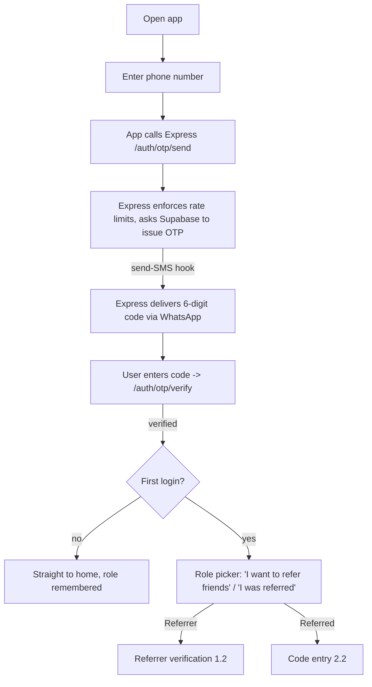
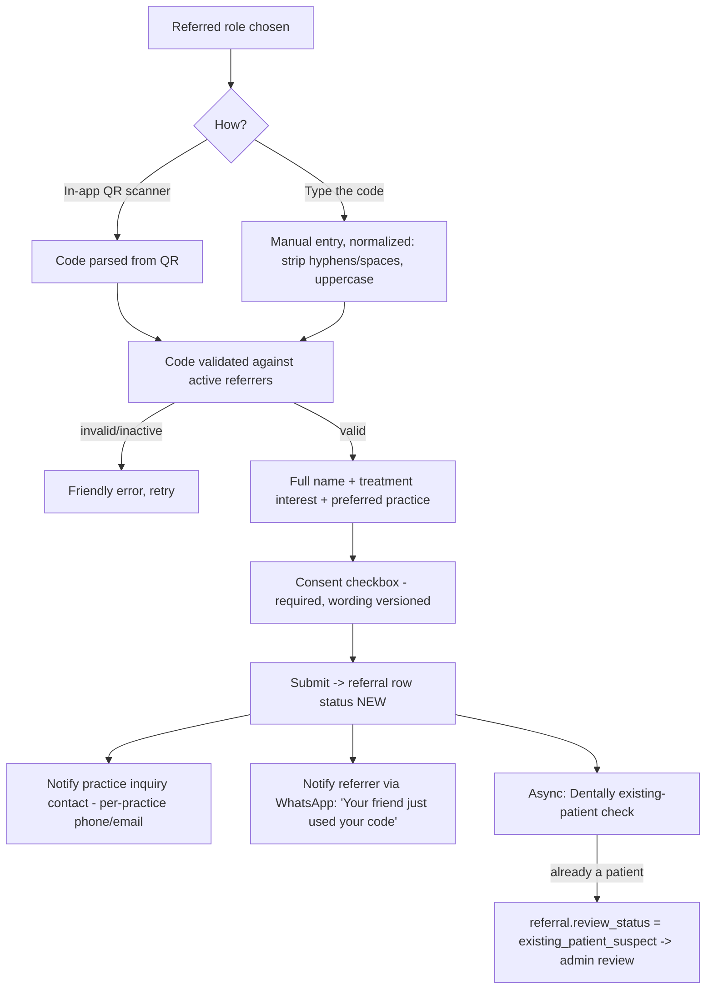
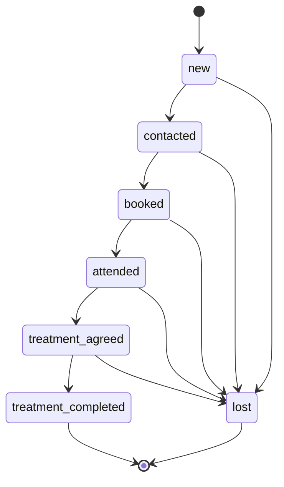
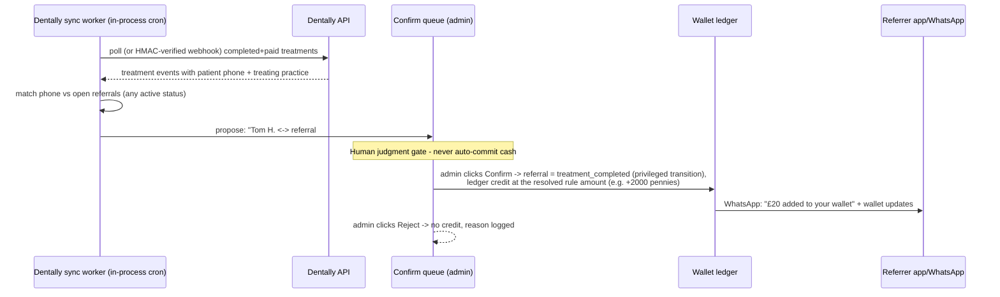
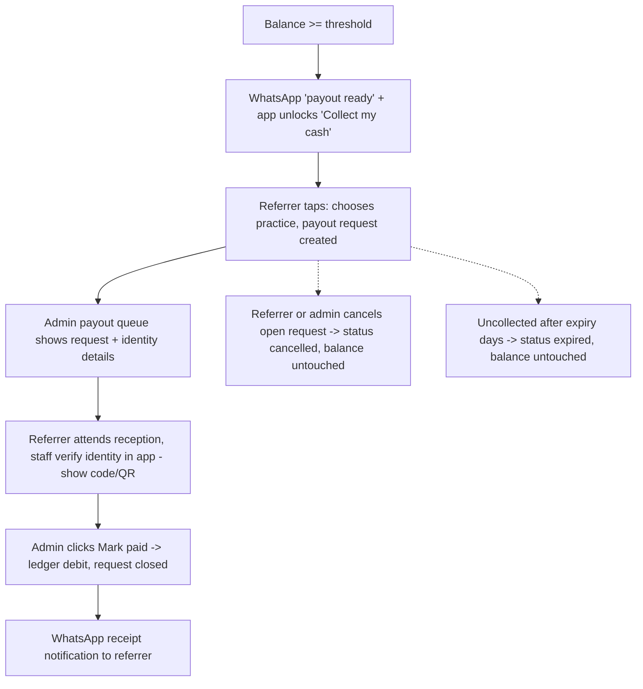

# GM Referral — Complete Flows

Companion to `DESIGN.md` (decisions and rationale) and `REQUIREMENTS.md` (numbered requirements).
Every flow below is MVP scope unless marked Phase 2.

Actors: **Referrer** (existing patient, verified against Dentally), **Referred** (friend, installs the app),
**Admin** (practice manager / front desk, web dashboard), **System** (Express API + Supabase + workers),
**Dentally** (treatment source of truth), **WhatsApp** (Meta Cloud API: OTPs + notifications).

---

## 1. Onboarding & Auth

### 1.1 First launch (both roles)

**OTP delivery and SMS fallback (explicit sub-flow).** Meta's Cloud API accepts a send synchronously but
reports "undeliverable / no WhatsApp" **asynchronously** via status webhooks, so fallback cannot be a
synchronous branch:

1. The Supabase send-SMS hook calls Express with the code. Express sends it via the channel resolved from
   the pre-send intent and `otp_channel_mode`, recording delivery metadata on `otp_deliveries` — **no code
   is ever stored by Express** (revised per outside voice, 2026-08-14).
2. Express receives Meta status webhooks (`/webhooks/whatsapp-status`, signature-verified). On
   `failed`/`undeliverable` within the OTP window it requests a **fresh** Supabase-issued code delivered via
   SMS — the same path as the button below. A late-arriving WhatsApp code is then stale (5-minute window).
3. The app independently shows a "Send via SMS instead" button 20 seconds after request; tapping it calls
   `/auth/otp/send` with `channel=sms`, which issues a fresh code delivered by SMS only.

Rules:
- **Channel launch mode**: `app_settings.otp_channel_mode` (`sms_only` at launch, `whatsapp_primary` once
  Meta business verification lands) gates every WhatsApp send, OTPs and notifications alike. Flipped from
  the admin dashboard, no deploy; also the kill switch for Meta suspensions.
- OTP: 6 digits, 5-minute expiry, max 3 sends per number per 5 minutes, max 5 verify attempts per code.
  **Enforcement point**: Express fronts both send and verify (`/auth/otp/send`, `/auth/otp/verify`) and keeps
  its own counters, because Supabase's built-in rate knobs are coarser than this policy. Supabase remains the
  issuer/verifier underneath.
- Sessions: long-lived refresh tokens (months), silent refresh, no forced logout. Logout only by user action
  or admin revocation.
- Phone numbers normalized to E.164 (`+44...`) at the API boundary. One user account per phone number.

### 1.2 Referrer verification (existing patients only)

1. After role pick, the app captures the user's **first + last name** (prefilled from Dentally when a match
   exists) and **notification opt-in** (checkbox, wording version + timestamp stored): "Message me about my
   referrals and rewards (WhatsApp or SMS)." — channel-neutral so consent covers `sms_only` launch mode.
   Utility notifications in §7 are sent only to opted-in users; OTPs are exempt (authentication, not
   marketing).
2. System calls Dentally: match the verified phone number against patient records.
3. **Match found** → `users.verification_status = 'verified'`, referral code + QR generated, home screen shown.
4. **No match** → `verification_status = 'pending_review'`; user sees "We couldn't find you as a GM Dental
   patient yet"; the admin **verification review queue** shows name + phone. Admin approves (manual link to a
   Dentally record → `verified`) or rejects (→ `rejected`). User is notified via WhatsApp either way.
5. **Dentally unreachable** → same as no-match: the account goes to `pending_review` and a retry job re-runs
   the match automatically when Dentally is back; auto-resolves without admin action if it then matches.
6. A referred user who completes treatment can later switch on the referrer role; same verification applies
   (they will match, since they are now a patient).

Edge cases: multiple Dentally patients sharing one phone (family) → always `pending_review`, never auto-match;
number ported/changed → admin can re-link.

## 2. Referral Capture

### 2.1 Referrer shares

- Home screen: QR code (hero), referral code, "Share on WhatsApp" (native share sheet with prefilled message).
- The prefilled share message **always contains the code as plain text** plus both store links, because the
  code must survive an app install.
- The QR encodes a deep link (`gmreferral://r/GMRF7K2X` + universal link; canonical 8-char code, hyphen is display-only). **Known limitation, accepted at
  MVP**: a QR scanned with the OS camera (not the in-app scanner) routes a user without the app to the store,
  and the code does not survive the install on iOS (no deferred deep linking at MVP). Android uses the Play
  Install Referrer to carry the code through install. On iOS the user types the code from the share message
  or from the referrer's screen; the code-entry screen is therefore the first screen of the referred flow.

### 2.2 Referred friend enters the code

Validation and fraud rules:
- Referred phone == referrer phone → reject at submit (`self_referral_not_allowed`).
- **Existing-patient check runs async** (submission is never blocked on Dentally): if the referred phone is
  already a Dentally patient, the referral is flagged `review_status = 'existing_patient_suspect'` and held
  for admin review instead of the normal pipeline (referral rewards are for new patients). If Dentally is
  down, the check retries; the referral stays workable and the flag can be applied retroactively.
- Same referred phone under multiple referrer codes → first code wins; later submits get a friendly rejection.
  A referral that ended `lost` does NOT block re-referral later (uniqueness excludes `lost`).
- Rate limit inquiries per device and number.
- Consent wording explicitly covers health data and disclosure of booking/completion milestones to the
  named referrer (UK GDPR Article 9 — see REQUIREMENTS NFR-02).

### 2.3 After submit (referred user's app)

The referred role does not dead-end at submit *(outside voice, 2026-08-14)*. Post-submit the app shows a
status view: "Request received — {practice} will call you", updating as the pipeline advances (booked date,
attended). This gives the referred user a reason the app exists on their phone (and concentrates the
Apple 4.2 minimum-functionality argument for the referred side). After treatment completes, this screen is
where "refer your own friends" activates the referrer role.

Front-desk policy *(documented, not new scope)*: friends who arrive saying "Sarah sent me" without the app
are helped to install it at reception — there is no staff-side referral entry at MVP (Phase 2 lever).

## 3. Pipeline (admin-driven)

Statuses carried over from the validated prototype design:

- Admin advances statuses from the dashboard as the front desk works the lead (call, book, attend).
- Adjacent-only transitions; anything else is a 409. **One privileged exception**: confirming a completion
  proposal (§4.1) may move a referral from any active status straight to `treatment_completed`; the audit
  event records the skipped stages. `lost` requires a reason. Every transition writes an audit event.
- The referrer's app shows each referral's stage with first-name-only privacy ("Priya M. — Booked").
- Status changes the referrer cares about (booked, completed) trigger WhatsApp utility notifications (opt-in
  holders only). Keeping months-long "pending" alive is a retention feature, not a nicety.

## 4. Commission (the money moment)

### 4.1 Dentally proposes, admin confirms

Rules:
- Proposals store the **treating practice** from the Dentally event. Rule resolution at confirm time:
  the rule scoped to the treating practice with the greatest `active_from ≤ now`, else the global rule with
  the greatest `active_from ≤ now`. Overlapping same-scope rules are rejected on save, so resolution is
  always unambiguous. The ledger row stores the amount, the rule id, and the treating practice id, so later
  rule changes never rewrite history and liability is attributable per practice.
- Matching is **exact E.164 phone match only** — the fuzzy-confidence machinery was cut (outside voice,
  2026-08-14). Every kind of miss (typo, landline, parent's number) is caught by the **aging report** (§6):
  referrals sitting at `booked`/`treatment_agreed` for ≥ N days with no proposal, prompting a human to
  investigate and use the manual path.
- Confirm is **blocked** while the referral is flagged `existing_patient_suspect`; a flag landing after a
  credit sends the referral to the review list, where admin may void via a reasoned adjustment. Confirm +
  status transition + ledger credit are one transaction; one credit per referral is enforced by a partial
  unique index.
- Sync is idempotent: proposals are unique per Dentally event id; re-running never duplicates. The worker
  keeps an `updated_since` cursor (advanced only on success), refreshes the `dentally_patient_index` that
  verification (§1.2) also reads, polls every 15 minutes, and only proposes treatments completed AFTER the
  linked referral was submitted (no launch-day backlog credits).
- Manual path always exists: admin can mark a referral completed and credit it without a Dentally proposal
  (Dentally down, data mismatch), with a required reason. This is the fallback, not the norm.

### 4.2 Wallet

- Append-only `wallet_ledger`: `credit` (commission), `debit` (payout), `adjustment` (admin, reason
  required). Balance = sum of rows, computed, never stored mutable.
- App wallet screen: current balance, progress bar to the payout threshold, lifetime earned, per-referral
  history.

## 5. Payout (cash at any practice)

Rules:
- Payout threshold is **global at MVP**, stored in `app_settings` (`payout_threshold_pennies`, working
  default 10000 = £100), admin-editable; shown in-app as "£40 to go". (Per-practice thresholds remain an
  open question in DESIGN.md; the settings shape allows adding them later.)
- The "payout ready" notification fires whenever balance ≥ threshold AND no open payout request AND the
  notified flag is clear; the flag is set on fire and cleared when the balance drops below threshold OR a
  payout is marked paid — so re-crossings are always announced, even when accumulated credits keep the
  balance above threshold across a payout *(outside voice fix, 2026-08-14)*.
- One open payout request per user. The referrer can cancel their own open request in the app; admin can
  cancel from the queue (reason required). Requests expire after `payout_expiry_days` (`app_settings`,
  default 14); expiry and cancellation leave the balance untouched.
- Only admin can mark paid; every payout carries who-paid-where-when in the audit log.
- Partial payouts out of scope at MVP: collect full available balance at request time.

## 6. Admin Dashboard flows

- **Levers**: commission amount (pennies, per rule scope), global payout threshold and payout expiry days
  (`app_settings`), rule scope (global or per practice), active-from date. Changing a lever affects future
  confirmations/requests only.
- **Verification review queue**: `pending_review` would-be referrers (approve = link to Dentally record;
  reject with reason).
- **Referral review list** (referrals only): `existing_patient_suspect` flags. Two decisions: *Clear*
  (`review_status = 'cleared'`, pipeline continues normally) or *Confirm existing patient* (referral →
  `lost` with reason `existing_patient`; never creditable).
- **Confirm-completions queue**: Dentally proposals (exact phone matches only) with treating practice;
  Confirm / Reject.
- **Aging report**: referrals at `booked`/`treatment_agreed` for ≥ N days with no proposal — the catch-all
  for phone-match misses, feeding the manual completion path.
- **Daily digest**: "n proposals, n payout requests waiting" sent to each practice inquiry contact via the
  notification outbox — front desks never need to remember to poll the dashboard.
- **Payout queue**: open payout requests per practice; Mark paid / Cancel.
- **Pipeline board**: referrals by status, per practice, with lost reasons.
- **Reports**: commission liability (total unpaid balances) plus two separate per-practice measures:
  **earned per practice** (credits, attributed via the ledger rows' practice id) and **paid out per
  practice** (debits, at the collecting practice). No per-practice net is reported, because cash can be
  collected at any practice. Also: funnel conversion, top referrers.
- **System health**: at MVP, failing external calls (Dentally, Meta, SMS) are logged with alertable log
  lines from the retry layer; a dashboard health card is Phase 2.
- **Exports** (owner only): Phase 2. At MVP the owner queries via the Supabase dashboard.
- **Roles**: `admin` (levers + queues, per practice) and `owner` (all practices, adjustments, exports, SAR
  handling). Admins authenticate with Supabase email auth + role claims.

## 7. Notifications matrix (all via Meta WhatsApp, SMS fallback)

Utility messages are sent only to users with recorded notification opt-in (§1.2). OTPs are exempt.
Every notification is written as a `notification_outbox` row in the SAME transaction as its triggering
event and drained with retry (NFR-10) — restarts lose nothing. In `sms_only` launch mode, utility
messages fall back to SMS; they are never silently dropped.

| Event (trigger) | Recipient | Template type |
|---|---|---|
| OTP code (on /auth/otp/send) | any user | Authentication |
| Friend used your code (referral submitted) | referrer | Utility |
| Friend booked consultation (status → booked) | referrer | Utility |
| £X added to your wallet (proposal confirmed / manual credit) | referrer | Utility |
| Payout ready (balance first crosses threshold) | referrer | Utility |
| Payout receipt (marked paid) | referrer | Utility |
| Verification approved/rejected (queue decision) | referrer | Utility |
| New inquiry alert (referral submitted) | practice inquiry contact (per-practice phone) | Utility |
| Daily queue digest (items waiting) | practice inquiry contact | Utility |
| Re-engagement nudge ("no referrals in 14 days") | referrer | Marketing (separate opt-in) — Phase 2 |

## 8. Funnel instrumentation (premise-3 tripwire)

Track as first-class events: `invite_sent`, `app_activated`, `share_tapped`, `code_entered`,
`referral_submitted`, `consult_booked`, `treatment_completed`, `commission_paid`.

`invite_sent` is the one stage generated **outside the app**: invites go to the ~20k GHL patients via
GHL/SMS campaigns run by the practice. At MVP its counts are imported from GHL campaign stats (manual entry
or CSV upload on the dashboard); the funnel report marks it as externally sourced. Everything from
`app_activated` down is measured natively.

The tripwire metric for the app-only referred flow is `code_entered → referral_submitted` completion plus
store-install attribution (Android Install Referrer); `share_tapped` is reported but documented as noisy —
share-sheet opens are not sends, especially on iOS *(outside voice re-anchor, 2026-08-14)*. If completion
collapses, the documented fallback is a hosted web capture page (Phase 2 lever, decision in DESIGN.md).

## 9. Phase 2 (explicitly out of MVP)

- Hosted web capture page (only if the funnel metric demands it).
- GHL sync (contacts + opportunities with source attribution) if not pulled into MVP (open question).
- Referrer leaderboard, monthly draw, tiered rewards.
- Apple/Google Wallet passes; percent-based commission rules with caps (data model already supports the
  shape); per-practice payout thresholds.
- Device-fingerprint fraud scoring; velocity limits beyond basic rate limiting.
- Marketing nudges via WhatsApp (separate opt-in consent category).
- iOS deferred deep linking (code survives App Store install).
- Admin conveniences trimmed by eng review (2026-08-14), each with a documented MVP stand-in: SAR
  export/anonymize endpoints (runbook at MVP), owner CSV exports (Supabase dashboard), system-health
  dashboard card (log alerts), CSV invite-count upload (manual number field).
- Staff-side referral entry at reception (MVP policy: help the friend install the app).
- Self-service phone-number change (MVP: admin re-link).
- Fuzzy proposal matching (only if the exact-match + aging-report design proves insufficient).
